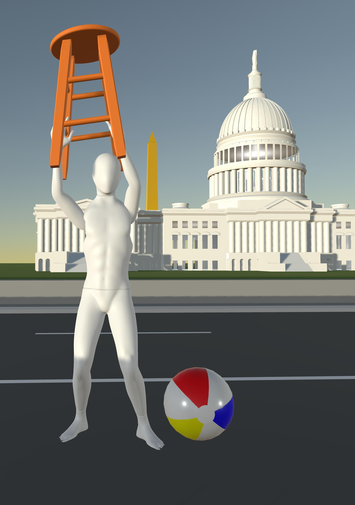
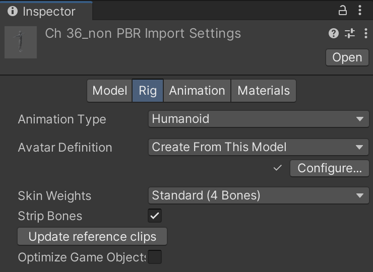
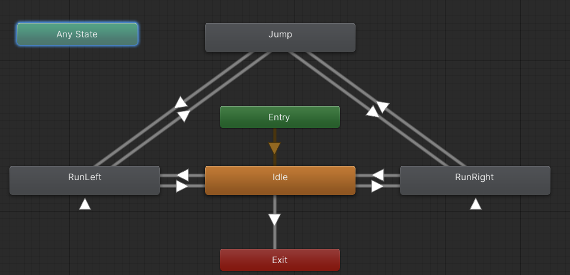
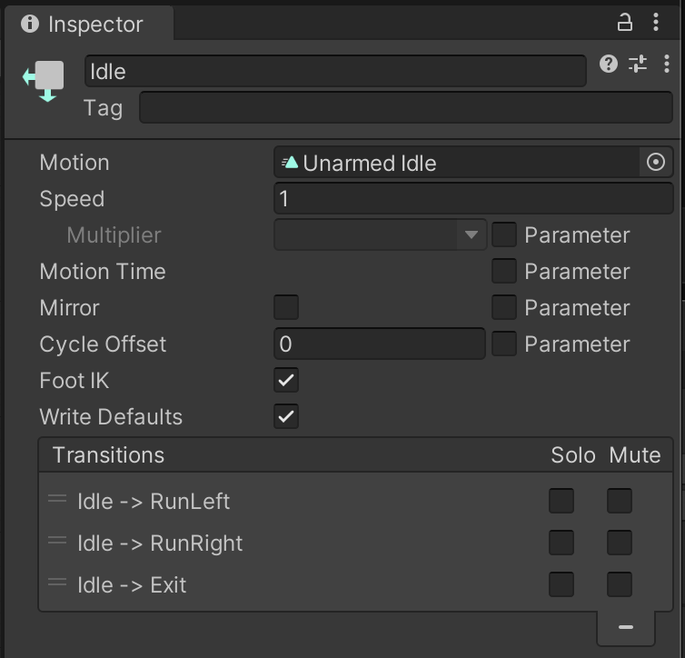
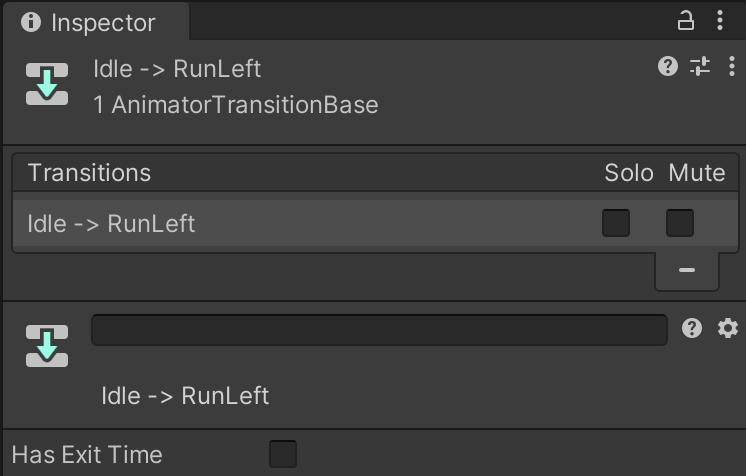
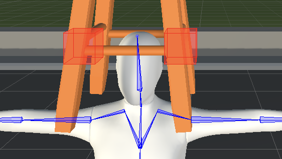

# dRuBbLe in 3-D
_A Silly Game With Silly Stools_

The smash hit game dRuBbLe in 3-D using the Unity engine.
The objective is to bounce a ball on top of a stool, either to cover the maximum distance, or to compete in a volleyball-like sport.
In the background are landmarks from Washington, DC.
dRuBbLe was previously written in pure Python code using the [Kivy](https://kivy.org) multiplatform development engine.

## Unity Editor Components

Built-in Unity `GameObject`s are used to define the kinematics between the world, player body, and stool, and the Unity physics engine is used to model their motion.
A character model and its animations are built from `.fbx` formatted models downloaded from [Mixamo](https://www.mixamo.com).
Rigging and inverse kinematics (IK) are used to animate the player running, and to have the player's hands hold the stool.

### Kinematics

The root frame for the player is designated as the `GameObject` named `dRuBbLePunk`.
This tracks the horizontal motion, and provides an interface to apply force and constraints to the player.

A `GameObject` named `body` contains the transform from the root to the center of gravity (CG) of the player, and has a `Rigidbody` component with a relatively large mass.
The kinematic constraints between `dRuBbLePunk` and `body` are applied in a `Configurable Joint`, which allows free motion in the X direction, and limited motion in the Y direction.
The `body` also has damping, which limits the running speed when a force is applied in the script.
In this configuration, the player can run left and right, and crouch or jump in the vertical direction within constraint limits.

A `GameObject` named `stool` contains the transform from the `body` to the top of the stool, and has a `Rigidbody` component with a relatively small mass.
The kinematic constraints between `body` and `stool` are applied in a `Configurable Joint`, which allows free motion in the local Y direction, and free rotation about the Z axis, with spring stiffnesses and damping applied in each.
In this configuration, the player can tilt the stool to point to the ball, or extend the stool to get a bigger bounce.

### Character

The Mannequin character model has been downloaded from [Mixamo](mixamo.com).
Root motion is referenced to the hip joint, which tracks motion of the `body`.
In each asset, from the inspector and the rig tab, make sure that `Humanoid` is selected as the `Animation Type`.

### Animation

Multiple `.fbx` files are downloaded for the same character, each containing a different animation, with the suffix `@animation` appended to the file name.
There is an `Animation Controller` component attached to the character model, which contains transitions between these.
A parameter named `velo` is created in the animation controller, which is updated at each frame in the player script, and tracks the horizontal velocity of the `body`, and is normalized to a value between 0 and 1.
`velo` is also used as a multiplier on the animation speed.
The default animation is an `Idle` standing pose.
A transition to the `RunLeft` animation is invoked when the velocity is above a positive threshold, and likewise to the `RunRight` animation for a negative velocity.

The `Foot IK` button is checked for each of the animations, which ensures that the player's feet do not pass through the ground.

The `Has Exit Time` box should be unchecked for each of the transitions between running and idle, which will ensure that these will happen immediately, not wait for the prior animation to finish.
On the other hand, the transition from each run animation to itself should have this checked, which will ensure that the running animations are smooth.

### Rigging

A `Rig Builder` object is added to the character model, with rigs for root motion, left and right arm motion.
Additionally there is a `Bone Renderer` object, which is created from the menu bar, `Animation Rigging -> Bone Renderer Setup`, which will pre-populate the transforms (much more convenient than doing it yourself).
The `RootRig` object applies a `Multi-Position Constraint` from the `body` to the character's hips, which ensures the vertical motion of the character tracks that of the body kinematics.
The `LeftArmRig` and `RightArmRig` both apply `Chain IK Constraint` to place the character's hands on the lower pegs of the stool.
There are targets associated with each, which are constrained to track the motion of these pegs, and are seen as red cube effectors in the image below.
The root for the constraint is the shoulder, and the tip is the middle finger, for each of the character's arms.

## Scripting Components

The script controlling an individual dRuBbLe player is called [Player.cs](dRuBbLe3D/Assets/Player.cs), which is attached to the `dRuBbLePunk` `GameObject`.
This accesses the `GameObject`s that handle character kinematics, animations, interactions with the ball, and camera motion.
Left/right, up/down, and stool rotation and extension motions are also handled here via user inputs and/or computer controls.

### Properties

Several `GameObject`s are accessed via public properties, with the referenced objects being added via the graphical editor, not script.
These include the `player` and `stool`, which reference the kinematic components, as well as the `ball` and `mainCamera`.
Additionally, the player `animator` is included as a public property.

Rigid bodies for the `player` and `stool` are accessed in the `Start()` method, where they are retained as private properties, and updated on each frame.
Other private properties include the keyboard keys associated with each type of movement, and the force magnitudes to be applied when the corresponding key is pressed.

### Controls

Keyboard inputs are handled in the `KeyboardControls()` method, which is called each time `Update()` is called.
The main left/right and up/down movements use WASD keys, which will correspond to forces applied in the X or Y direction on the `body`.
The stool can be rotated about the Z axis, or extended in the Y axis of the rotated frame using arrow keys.

### Camera

Camera updates are called by the `FixedUpdate()` method, which ensures that the motion is relatively natural and uniform, whereas if it was called on the regular `Update()` method it could jerk if the update rate becomes non-uniform.
The camera is intended to aim at roughly the midpoint between the player and the ball, with some softening applied to smooth the transitions and help convey motion.
When the ball is in the air, a `desiredPosition` variable is calculated by taking the average of the player and ball position, and offsetting in the Z direction by a value proportional to the differential distance between player and ball.
When the ball is on the ground, the camera will stay with the player.
At each update, the camera will move from its current position to a new position that is a weighting factor times the desired position.
